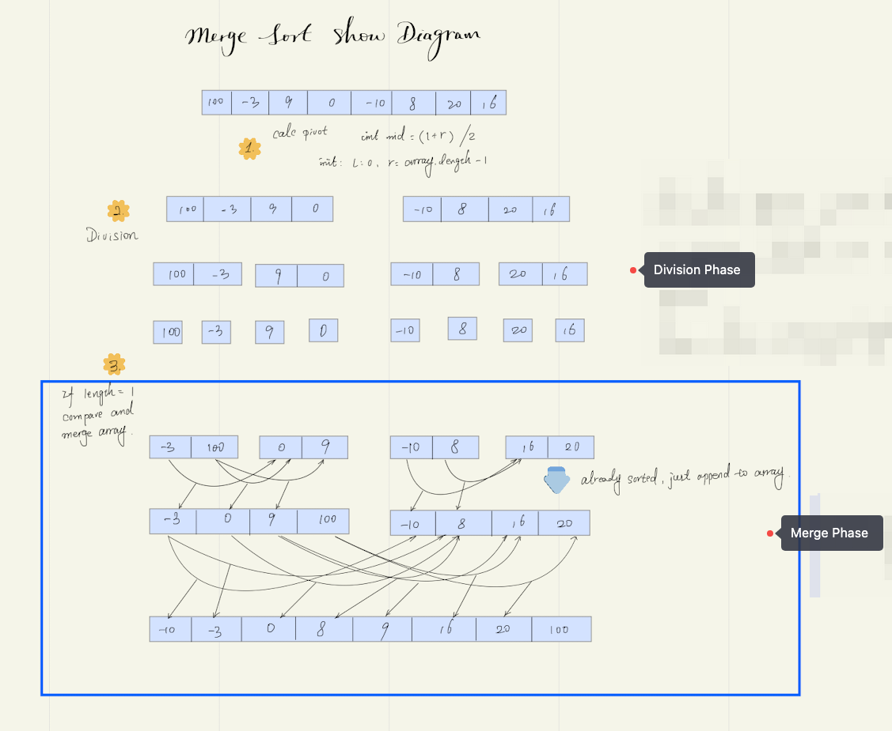

<div align='center'>
  <h1>
    <b style='color: #58a6ff'>Merge Sort</b>
  </h1>
</div>

## Introduction
;

## Coding
```javascript
function mergeSort(array, tempArr, l, r) {
  if (l < r) {
    // mid pivot
    let m = Math.floor((l + r) / 2);
    // left
    mergeSort(array, tempArr, l, m);
    // right
    mergeSort(array, tempArr, m + 1, r);
    // merge array
    mergeSort(array, tempArr, l, m, r);
  }
}

function merge(array, tempArr, l, m, r) {
  // left first element
  let left  = l;
  // rigjt first element
  let right = m + 1;
  // temp pos
  let pos = l;

  // merge array
  while(left <= m && right <= r) {
    if (array[left] <= array[right]) {
      tempArr[pos++] = array[left++];
    } else {
      tempArr[pos++] = array[right++];
    }
  }

  // check left rest elements
  while(left <= m) {
    tempArr[pos++] = array[left++];
  }

  // check right rest elements
  while(right <= r) {
    tempArr[pos++] = array[right++];
  }

  // merge tempArr into array
  while(l <= r) {
    array[l] = tempArr[l];
    l++;
  }
}
```