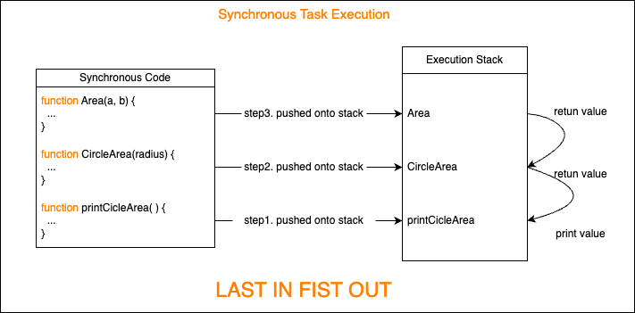
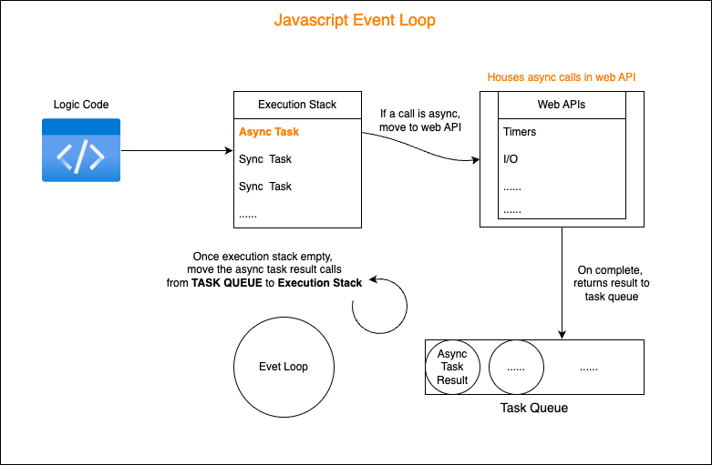

<div align='center'>
  <h1>
    <b style='color: #58a6ff'>JS Event Loop</b>
  </h1>
</div>

## Synchronous Calls
Generally, Javascript code for your business logic is running by `synchronous` way by default.  

The synchronous tasks will be push onto the `main call stask` of Javascript main execution thread. There`s no problem if the task is tiny and can be completed in a very short time.  

Let`s show some code for synchronous call execution:  
```javascript

/**
 * @description
 * Define area = a * b;
 * 
*/
function Area(a, b) {
  if (!a || !b) {
    return 0;
  }

  if (isNaN(a) || isNaN(b)) {
    return 0;
  }

  return a * b;
}

/**
 * @description
 * Calc circle area
*/
function CircleArea(radius) {
  return Area(Math.PI, radius ** 2)
}

function printCicleArea() {
  const area = CircleArea(2);
  console.log(area);
}
```
Let`s show code execution by graph:
 


But if there is a large task which needs a long time to calculate and execute, waht to do ?

> Some common reasons resulting in these program delays include:
> - A while loop with a high iteration count (e.g. 100000).
> - A network request to an external web server with large amount of data.
> - An event that waits for a timer to complete.
> - Image processing.

One of the way is using `asynchronous` method to handle.

## Asynchronous Calls


## Callback Hell

## Event Loop in Node.js
