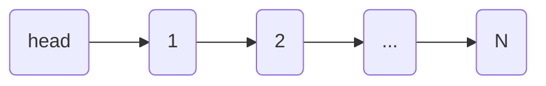
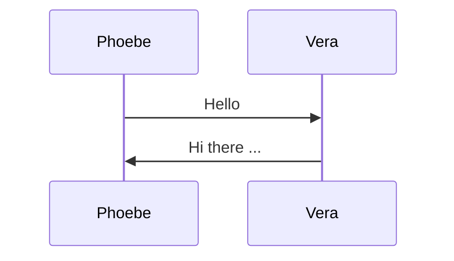

  <h1>
    <b style='color: #ff3670'>Mermaid </b>
    <b style='color: #58a6ff'>Practice</b>
  </h1>

## 1. Flow Diagrams

## 2. Sequence Diagrams
[A Sequence diagram](https://mermaid.js.org/syntax/sequenceDiagram.html) is an interaction diagram that shows how processes operate with one another and in what order.  

For more detailed use samples, just go to path [sequence](./sequence/README.md).

