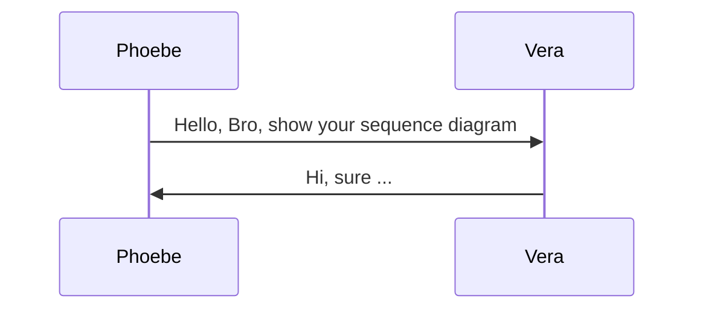

<div align='center'>
  <h1>
    <b style='color: #ff3670'>Sequence Diagram</b>
  </h1>
</div>

## Introduction
Sequence Diagram is one kind of diagrams which showing how the process handled with one another and in what order.




## Syntax Code

- #### SequenceDiagram
  
  Tells `Mermaid` diagram type, which should be in the fist line of `Mermaid` code.

  ```javascript
    ...mermaid
    // %% Fist line, declare diagram type
    sequenceDiagram

      Phoebe ->> Vera: Hello
      Vera ->> Phoebe: sd
    
    ...

  ```

  ```mermaid
  sequenceDiagram

    Phoebe ->> Vera: Hello, Bro
    Vera ->> Phoebe: Hi ~, ...

  ```

- #### Participant

  - Implicitly define the participants and the participants are rendered in order of appearance in the diagram source text.
  
  - Define `aliases`, e.g, if the name of `participants` is too long, it will be a good choice to use aliases, ["Alice" => "A"]: `participant A as Alice`, **"A"** is the alias of **Alice**.

  ```javascript
    ...mermaid
    // %% Fist line, declare diagram type
    SequenceDiagram

      participant Phoebe
      participant Vera

      Phoebe ->> Vera: Hello, Bro
      Vera ->> Phoebe: Hi ~, ...
    
    ...
  ```

  ```mermaid
  sequenceDiagram
    participant Phoebe
    participant Vera

    Phoebe ->> Vera: Hello, Bro
    Vera ->> Phoebe: Hi ~, ...

  ```

- #### Actor
  - A symbol,   if you do not like defafult **rectangle** shape, you can use `actor` to declare.
  
  - **actor** can use `as` operation for name aliases also.
  
  ```javascript
    ...mermaid
    // %% Fist line, declare diagram type
    SequenceDiagram

      actor Phoebe
      actor Vera

      Phoebe ->> Vera: Hello, Bro
      Vera ->> Phoebe: Hi ~, ...
    
    ...
  ```

  ```mermaid
  sequenceDiagram
    actor Phoebe
    actor Vera

    Phoebe ->> Vera: Hello, Bro
    Vera ->> Phoebe: Hi ~, ...

  ```
   
- #### Grouping
  
  - Use `box` to group.
  
  - `box` and `end` need to use in pairs, otherwise mermaid can not render the diagram properly.
  
  - Color declare is  accessible for grouping, `box [color] [name]`, if color is ignored, the group background will be transparent.
  
  - Name aliases is not available in box declare. <br/> 

  ```javascript
    ...mermaid
    // %% Fist line, declare diagram type
    SequenceDiagram

      participant P as Phoebe
      participant V as Vera
      participant E as Eric

      box Group P and V
        participant P
        participant V
      end

      box orange Group E
       participant E
      end

      P ->> V: Hello, Bro
      V ->> P: Hi ~, ...

      E -->> P: Hi, I am new here 
    
    ...
  ```

  ```mermaid
  sequenceDiagram
    participant P as Phoebe
    participant V as Vera

    box Group P and V
      participant P
      participant V
    end

    participant E as Eric

    box orange Group E
      participant E
    end

    P ->> V: Hello, Bro
    V ->> P: Hi ~, ...

    E -->> P: Hi, I am new here 

  ```

- #### Messages

  - Messages can be of two displayed either **solid or with a dotted** line. 
  
  ```javascript
    [actor | participant] [arrow] [[actor | participant]]: message
  ```

  - Arrow types as below:
    - `->`  : Solid line without arrow, showing as
    ```mermaid
    sequenceDiagram
      
      P -> V: P and V linked by solid line without arrows.

    ```

    - `-->` : Dotted line without arrow, showing as
    ```mermaid
    sequenceDiagram

      P --> V: P and V linked by dotted line without arrows.

    ```

    - `->>` : Solid line with arrowhead, showing as
    ```mermaid
    sequenceDiagram

      P ->> V: P and V linked by solid line with arrows.

    ```
    
    - `-->>`: Dotted line with arrowhead, showing as
    ```mermaid
    sequenceDiagram

      P -->> V: P and V linked by dotted line with arrows.

    ```

    - `-x`  : Solid line with a cross at the end, showing as
    ```mermaid
    sequenceDiagram

      P -x V: P and V linked by solid line with a cross at the end.

    ```

    - `--x` : Dotted line with a cross at the end, showing as
    ```mermaid
    sequenceDiagram

      P --x V: P and V linked by dotted line with a cross at the end.

    ```

    - `-)`  : Solid line with an open arrow at the end (async), showing as
    ```mermaid
    sequenceDiagram

      P -) V: P and V linked by solid line with an open arrow at the end (async).

    ```

    - `--)` : Dotted line with a open arrow at the end (async), showing as
    ```mermaid
    sequenceDiagram

      P --) V: P and V linked by dotted line with an open arrow at the end (async).

    ```

- #### Activations
  It is accessible to active or deactive an actor or a participant.
  - `activate` or `deactivate` key word.
  - `+` or `-` operator instead.
  
  you can choose one of the both above to **active** or **deactive** the participant you want, e.g.

  ```javascript
    ...mermaid
    sequenceDiagram

      participant P as Phoebe
      participant V as Vera

      P ->>  V: Hi
      activate V   # activate Vera
      V -->> P: Hello
      deactivate V # when Vera returns, deactivate

    ...

  ```

  ```mermaid
  sequenceDiagram

    participant P as Phoebe
    participant V as Vera

    P ->>  V: Hi
    activate V   # activate Vera
    V -->> P: Hello
    deactivate V # when Vera returns, deactivate

  ```

  If use `+` and `-` operator, <br/>

  ```javascript
    ...mermaid
    sequenceDiagram

      participant P as Phoebe
      participant V as Vera

      P ->>  +V: Hi    # activate Vera, "+" === activate V
      V -->> -P: Hello # when Vera returns, deactivate, "-" === deactivate V

    ...

  ```

  ```mermaid
  sequenceDiagram

    participant P as Phoebe
    participant V as Vera

    P ->>  +V: Hi
    V -->> -P: Hello

  ```

- #### Notes
  It is accessible in `mermaid` to put note label on an actor or actors, which types showing as:

  - **left of**  : notes placed to the participants's left
  ```javascript

    ...mermaid
    sequenceDiagram
      participant P as Phoebe
      participant V as Vera

      P ->>  +V: Hi

      %% use Note to declare
      Note right of V: This is a note label on the right side of Vera
      
      V -->> -P: Hello

    ...

  ```
  
  ```mermaid
  sequenceDiagram
    participant P as Phoebe
    participant V as Vera

    P ->>  +V: Hi
    Note right of V: This is a note label on the right side of Vera
    V -->> -P: Hello

  ``` 

  - **right of** : notes placed to the participants's right
  
  ```javascript

    ...mermaid
    sequenceDiagram
      participant P as Phoebe
      participant V as Vera

      P ->>  +V: Hi

      %% use Note to declare
      Note left of V: This is a note label on the left side of Vera
      
      V -->> -P: Hello

    ...

  ```
  
  ```mermaid
  sequenceDiagram
    participant P as Phoebe
    participant V as Vera

    P ->>  +V: Hi
    Note left of V: This is a note label on the right left of Vera
    V -->> -P: Hello

  ``` 

  - **over**     : notes spanning two participants
  ```javascript

    ...mermaid
    sequenceDiagram
      participant P as Phoebe
      participant V as Vera

      P ->>  +V: Hi
      V -->> -P: Hello

      %% use Note to declare
      Note over P, V: This is a note label spanning Phoebe and Vera

    ...

  ```
  
  ```mermaid
  sequenceDiagram
    participant P as Phoebe
    participant V as Vera

    P ->>  +V: Hi
    V -->> -P: Hello

    %% use Note to declare
    Note over P, V: This is a note label spanning Phoebe and Vera

  ``` 

- #### Loops
  
  If you want to display a loop in sequence diagram, it is also accessible.

  - **declare**
  ```javascript
    
    %% use loop and end keywords
    %% [loop name] is optional

    loop [loop name]
      %% your diagram
    end 

  ```
  - **sample**
  ```mermaid
  sequenceDiagram
    participant P as Phoebe
    participant V as Vera


    loop
      P -->> V: hello, how is it going? 
      V -->> P: Hi, pardon ?
    end
  ```

- #### Alt
  
- #### Parallel
  
- #### Critical Region

- #### Break

- #### Background Highlighting

- #### Comments

- #### Entity codes to escape characters

- #### sequenceNumbers

- #### Actor Menus

- #### Styling

- #### Configuration