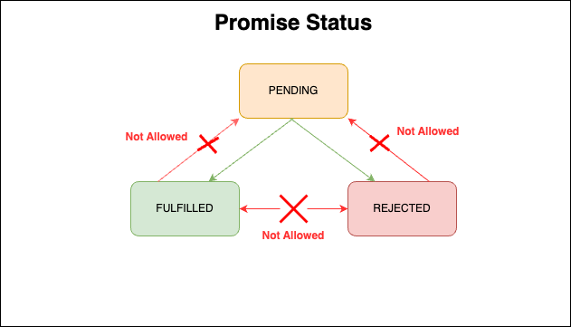

<div align='center'>
  <h1>
    <b style='color: #58a6ff'>Promise Impl</b>
  </h1>

  <p>This implementation for <b>Promise</b> is absolutely for practice and strictly following
    <b>
      <a href="https://promisesaplus.com/">PromiseA+</a>
    </b>
  </p>
</div>

## TL; DR
If you want to read the code, just go the file [index.js](./index.js).

## Introduction
A promise represents the eventual result of an asynchronous operation.   
The primary way of interacting with a promise is through its `then` method, which registers callbacks to **receive either a promise’s eventual value or the reason why the promise cannot be fulfilled**.

What should be clarified is that `new Promise` operation is **not a asynchronous process**. The only **asynchronous process** is in `then`, `resolve` etc. operations.

## Terminology
- **Promise:**  
An Object or a Function that is with a `then` function.

- **Thenable:**  
A function is defined by `Promise` object or function.

- **Value:**  
Any legal javascript value. When Promise `resolve`, value will be assigned.

- **Exception:**  
A value that is thrown using the throw statement.

- **Reason:**  
A value that indicates why a promise was rejected.  
  
## Promise Status
There are **3 status** in Promise, which are:

- **Pending**  
Need transition to either the `fulfilled` or `rejected` state.

- **Fullfiled**  
  - Must not transition to any other state.
  - Must have a value, which must not change.

- **Rejected**  
  - Must not transition to any other state.
  - Must have a reason, which must not change.



Here, **must not change** means immutable identity `(i.e. ===)`, but does not imply deep immutability.

## Then Impl
A promise must provide a `then` method to access its current or eventual value or reason.  

`Then` function offers **2** arguments, here we create a `class`(or `function` if you need) called `JSPromise`:
```javascript
class JSPromise {
  ...

  /**
   * 
   * @param { (...args) => T } onFulfilled
   * If promise resolve
   * receive the value and handle you business logic
   * 
   * @param { (...args) => T } onRejected
   * Once promise is rejected
   * maybe there`s something need to deal with with the reject reason
  */
  then(onFulfilled, onRejected) {
    ...
  }
}
```
- **onFulfilled & onRejected**
  - Both of them should be `function`, if not, just ignore it.
  - Both of them are optional.

- **onFulfilled**
  - It must be called after **Promise** is `fulfilled`, with promise’s value as its first argument.
  - If a promise is not fulfilled, `onFulfilled` can not be called then.
  - It must not be called **more than once**.

- **onRejected**
  - It must be called after **Promise** is `rejected`, with promise’s reason as its first argument.
  - If a promise is not rejected, `onRejected` can not be called then.
  - It must not be called **more than once**.

Here we drop some sample code. This code is not the final one.

```javascript
// code sample
class JSPromise {
  ...

  then(onFulfilled, onRejected) {
    // onFulfilled
    if (!onFulfilled || typeof onFulfilled !== 'function') {
      return this;
    }
    if (this.status === 'FULFILLED') {
      onFulfilled(this.value);
    }

    // onRejected 
    if (!onRejected || typeof onRejected !== 'function') {
      return null;
    }
    if (this.status === 'REJECTED') {
      onRejected(this.reason);
    }

    ...
  }
}
```

- **[extra requirement](https://promisesaplus.com/)**
  `onFulfilled` or `onRejected` must not be called until the [execution context](https://es5.github.io/#x10.3) stack contains only platform code.
  
- **Calling**
  `onFulfilled` and `onRejected` must be called as functions (i.e. with no `this` value).

- **Multiple Calling**
  `then` may be called multiple times on the same promise.
  - If | when promise is `fulfilled`, all respective `onFulfilled` callbacks must execute **in the order of their originating calls** to then.
  - If | when promise is `rejected`, all respective `onRejected` callbacks must execute in the order of their originating calls to then.

- **Then Return Type**
  `then` must return a promise.
  ```javascript
  const newpromise = promiseold.then(onFulfilled, onRejected);
  ```

  - If either `onFulfilled` or `onRejected` returns a value `x`, run the Promise Resolution Procedure [[Resolve]] (**promise2**, `x`).
  - If either `onFulfilled` or `onRejected` throws an `exception e`, **promise2** must be `rejected` with `e` as the reason.
  - If `onFulfilled` is not a function and **promise1** is fulfilled, **promise2** must be `fulfilled` with the same value as **promise1**.
  - If `onRejected` is not a function and **promise1** is rejected, **promise2** must be `rejected` with the same reason as **promise1**.

## The Promise Resolution Procedure

To run [[Resolve]](promise, x), perform the following steps:

- `promise` and `x` must not refer to the sample object, because this operation will lead to endless loop. In this case, just throw `TypeError` as reject [reason]().

- If `x` is a `Promise`, adop its state:
  - If `x` is pending, promise must remain pending until `x` is `fulfilled` or `rejected`.
  - If/when `x` is `fulfilled`, fulfill promise with **the same value**.
  - If/when `x` is `rejected`, reject promise with **the same reason**.
  
  ```javascript
  ...

  then(onFulfilled, onRejected) {
    // this.value equals with x metioned above.
    if (this.value === this) {
      reject(new Error('TypeError: ...'))
    }

    if (this.value instanceof JSPromise) {
      // pending util resolve or reject ...
    }
  }

  ...

  ```

- If `x` is an object or function:

  - Let then be `x.then`.

  - If retrieving the property `x.then` results in a thrown exception `e`, reject promise with `e` as the reason.

  - If `then` is a `function`, call it with `x` as `this` (x.then(...)), first argument `resolvePromise`, and second argument `rejectPromise`, where:

    - If/when `resolvePromise` is called with a value `y`, run [[Resolve]] (promise, `y`).

    - If/when `rejectPromise` is called with a reason r, reject promise with `r`.

    - If **both `resolvePromise` and `rejectPromise` are called**, or multiple calls to the same argument are made, the first call takes precedence, and any further calls are ignored.

    - If calling then throws an exception `e`:
      - If `resolvePromise` or `rejectPromise` have been called, ignore it.
      - Otherwise, `reject` promise with `e` as the reason.

  - If `then` is not a function, `fulfill` promise with `x`.

- If `x` is not an object or `function`, `fulfill` promise with `x`.

>If a `promise` is resolved with a `thenable` that participates in a **circular thenable chain**, such that the recursive nature of [[Resolve]](promise, thenable) eventually causes [[Resolve]](promise, thenable) to be called again, following the above algorithm will lead to infinite recursion. Implementations are encouraged, but not required, to detect such recursion and reject promise with an informative TypeError as the reason.  

## Summarize

## Notes

<div style="border: .5px dashed gray; padding: 10px; background: #f2f2f2">
  <li>
    Here “platform code” means engine, environment, and promise implementation code. In practice, this requirement ensures that onFulfilled and onRejected execute asynchronously, after the event loop turn in which then is called, and with a fresh stack. This can be implemented with either a “macro-task” mechanism such as setTimeout or setImmediate, or with a “micro-task” mechanism such as MutationObserver or process.nextTick. Since the promise implementation is considered platform code, it may itself contain a task-scheduling queue or “trampoline” in which the handlers are called.
  </li>
  <li>
    That is, in strict mode this will be undefined inside of them; in sloppy mode, it will be the global object.
  </li>
  <li>
    Implementations may allow promise2 === promise1, provided the implementation meets all requirements. Each implementation should document whether it can produce promise2 === promise1 and under what conditions.
  </li>
  <li>
    Generally, it will only be known that x is a true promise if it comes from the current implementation. This clause allows the use of implementation-specific means to adopt the state of known-conformant promises.
  </li>
  <lI>
    This procedure of first storing a reference to x.then, then testing that reference, and then calling that reference, avoids multiple accesses to the x.then property. Such precautions are important for ensuring consistency in the face of an accessor property, whose value could change between retrievals.
  </lI>
  <li>
    Implementations should not set arbitrary limits on the depth of thenable chains, and assume that beyond that arbitrary limit the recursion will be infinite. Only true cycles should lead to a <b>TypeError</b>; if an infinite chain of distinct thenables is encountered, recursing forever is the correct behavior.
  </li>
</div>
