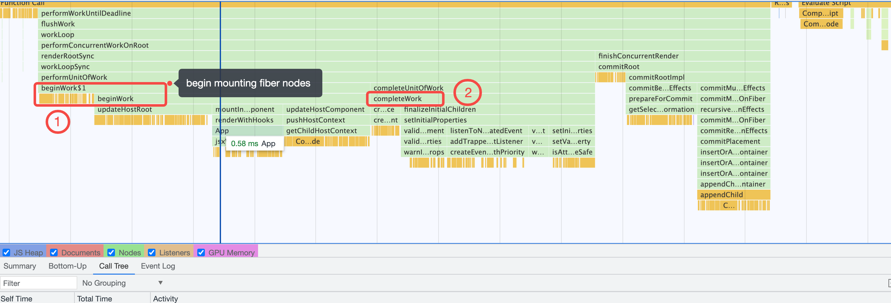
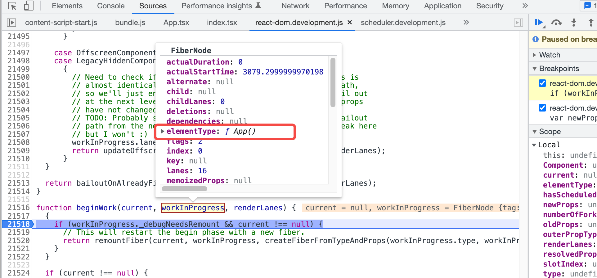
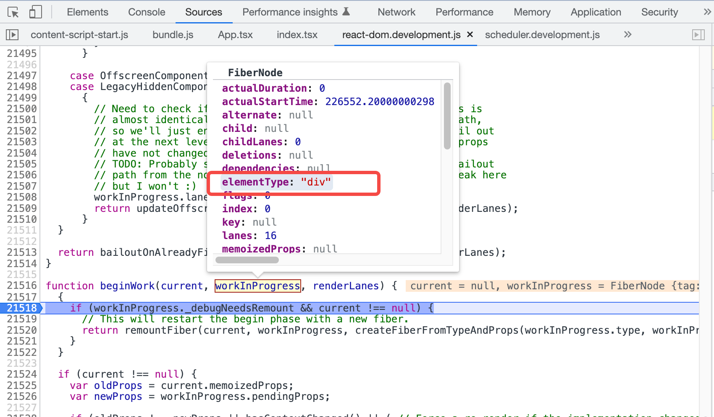

<div align='center'>
  <h1>
    <b style='color: #58a6ff'>React Component Mount & Update</b>
  </h1>

  <!-- <p>This repository is mainly recording some front-end basic knowledge.</p> -->
</div>

## 1. Beginwork & Completework


Fist of all, we show some source code of `function beginWork` of React:

```javascript
function beginWork(current, workInProgress, renderLanes) {
  ...
}
```

<div style="padding: 10px; border: 0.5px dashed gray; background: #f2f2f2">

- Fist call
  - `current` element is **not null**, which is the first node (`node: FiberNode`) entering `beginwork`.

  - **node type**: 3, a `HostRoot` node, which means **root of a host tree. Could be nested inside another node**, defined in the [ReactWorkTags.js](https://github.com/facebook/react/blob/main/packages/react-reconciler/src/ReactWorkTags.js).

- Second Call
  - `current`: null
    - During the first screen rendering, only the root node of the current application exists `current` node, and other nodes are in the `workInProgress`. 
  - `workInProgress`
    - **elementType**: `ƒ App() ... `
    

- Third Call
  - `current`: null
  - `workInProgress`
    - **elementType**: `div`
    

- Fourth Call
  - `current`: null
  - `workInProgress`
    - **elementType**: `header`

- Fifth Call
  - `current`: null
  - `workInProgress`
    - **elementType**: `img`

</div>

<p>

  In our demo of React, the `` HTML Element does not hava children, therefore, react will execute `completework` process. Let us show some code for  `completeWork`:

</p>

```javascript
function completeWork(current, workInProgress, renderLanes) {
  ...
}
```
<div style="padding: 10px; border: 0.5px dashed gray; background: #f2f2f2">

  - <span style="color: #a8323c">completework</span> running fpr FiberNode ``, after this.
  - react will find the sibling node of ``.
  - if found, then <span style="color: #a8323c">beginwork</span> again,
    - e.g. in our demo, FiberNode `<p>...</p>` will enter <span style="color: #a8323c">beginwork</span>.
  - otherwise, execute the parent node <span style="color: #a8323c">completework</span>.
  - <b>once the root node of current application which type is 3 mentioned above</b> executed <span style="color: #a8323c">completework</span>, the <span style="color: #a8323c">beginwork & completework</span> finished.

  <p>

    There`s some special case:
    - if a node (e.g. <code> node in demo) has only one child and which child is a text node,
    - react will not create a text fiber node for node <code>.
    - this is the React's optimization for a single text node.
  </p>

</div>

Let`s see the whole execution process from the diagram below:


## 2. What happened in beginwork

## 3. What happened in completework

## 4. Summarize
